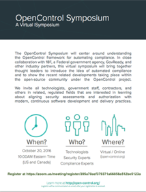

# OpenControl Virtual Symposium
## October 20, 2016, 10 am – 6 pm (Eastern Time)

### [Register Today](https://zoom.us/meeting/register/395a70acf379371a66858a512be5123a)

The OpenControl Symposium will center around understanding
the OpenControl framework for automating compliance assessment and authorization packages. In close
collaboration with 18F (a federal government team), GovReady, and
other industry partners, this virtual symposium will bring together
thought leaders to introduce the idea of automated compliance
and to show the developments taking place within
the open-source community under the OpenControl project.

### You're Invited

We invite all **technologists**, **government staff**, **contractors**, **security experts**, **compliance experts**, and
others in related regulated fields who are interested in learning
about aligning security assessments and authorization with
modern, continuous software development and delivery practices.

### Where

This is a free online video-conference event. [Register today!](https://zoom.us/meeting/register/395a70acf379371a66858a512be5123a) You'll receive logistical details by email after registering.

## Why Attend

* See [OpenControl](https://github.com/opencontrol) and [Compliance Masonry](https://github.com/opencontrol/compliance-masonry) in action, and learn how to start using them.

* Meet like-minded professionals who believe in both innovation and security.

* Align security assessments and authorization with modern CI/CD (Continuous Integration / Continuous Deployment) pipelines.

* Help set priorities for OpenControl's evolution.

# Agenda

The entire day of events will be virtual via [Zoom.us](https://zoom.us/meeting/register/395a70acf379371a66858a512be5123a) to grow our community. All times are in Eastern Time. All of the morning sessions will be recorded and posted here following the event, and the notes from the afternoon sessions will remain available.

### Welcome
10:00 AM - 10:05 AM (Greg Elin, GovReady)

### Logistics for Day
10:05 AM - 10:15 AM

### Keynote - A Better Way to Do Compliance

**Invite your bosses to this part!**

10:15 AM - 10:30 AM (Josh McKenty, Pivotal)

### The Importance of OpenControl
10:30 AM - 10:35 AM (Dominic Delmolino, Accenture Federal)

### Quickstart
10:35 AM - 10:50 AM

### Prioritization Breakouts
10:50 AM - 11:15 AM

### Prioritization Summation
11:15 AM - 11:35 AM

### OpenSession Planning
See [the planning doc](https://docs.google.com/document/d/1DVadZKF2SERPULteyc_jEXvjq65oFYbF-JRZd-zY090/edit#).

11:35 AM - 12:00 PM

### Lunch
12:00 PM - 1:00 PM

### Intro to Afternoon Open Sessions
1:00 PM - 1:05 PM

### Afternoon Open Sessions
1:05 PM - 5:00 PM

### Event Summary & Next Steps
5:00 PM - 6:00 PM

### Happy Hour
6:30 PM - ?

For those in DC, we will be heading to Third Thursdays, a regular happy hour for people doing digital work in and around government. We will post where to find us specifically in Slack.

[Eighteenth Street Lounge](http://www.eighteenthstreetlounge.com/), [1212 18th St NW, DC](https://www.google.com/maps/place/Eighteenth+Street+Lounge/@38.9062117,-77.0419716,15z/data=!4m5!3m4!1s0x0:0xe2eeebf181e49255!8m2!3d38.9062117!4d-77.0419716)

## [Register Today](https://zoom.us/meeting/register/395a70acf379371a66858a512be5123a)

(And [join the announcement mailing list](http://eepurl.com/cg0ZE1) too!)
